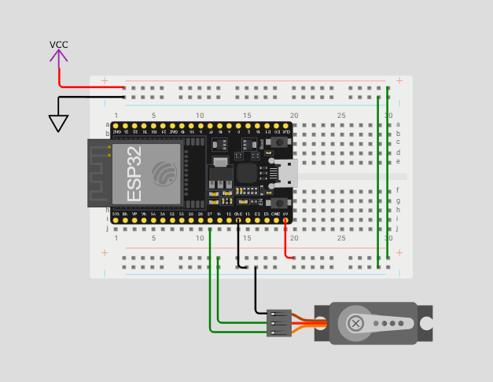

# MeowTime 🐾

**MeowTime** est une application React permettant de programmer l'alimentation automatique de mon chat via une carte **ESP32**.

## 🚀 Fonctionnement

- L'utilisateur planifie des repas depuis l'interface web.
- À l'heure prévue, l'application envoie une requête HTTP à l'ESP32 via le réseau local ou Internet.
- L'ESP32 actionne un circuit pour distribuer la nourriture à Mimi 🐱.


## 📦 Technologies

- React (Frontend)
- Node.js (Backend)
- ESP32 (Microcontrôleur Wi-Fi)
- HTTP API pour la communication

## 🔌 Circuit ESP32
- 1 breadboard
- 1xESP32
- 1xServo moteur
- DC 5v power cord
- 5V power supply for breadboard
- jumper wires



## 🌳 Environnement
- Serveur
Crée un fichier `.env` à la racine du dossier `serveur/` avec le contenu suivant : 
```bash
ESP32_IP=
ESP32_PORT=
PORT=
JWT_SECRET=
```
Remplace les valeurs du PORT par celle que tu utilises puis marque l'addresse IP public de ton routeur pour ESP32_IP ou mais l'addresse ip locale si tu veux utiliser l'application que localement. Aussi choisir une clé pour les JSON web tokens.
- ESP32
Créer un fichier secrets.h avec :
```bash
const char* ssid = "VOTRESSID";
const char* password = "VOTREPASSWORD";
```
et les remplacés par ceux de votre réseau.

## ⏩ Port Forwarding 
Pour permettre à l’ESP32 de recevoir des requêtes HTTP depuis l’extérieur de votre réseau local, comme celles envoyées par votre site MeowTime (hébergé en ligne ou sur un autre réseau), vous devez configurer le port forwarding sur votre routeur.

Cela redirige les requêtes venant d'Internet vers votre ESP32, qui est connecté à votre réseau local.
Étapes:
    1. Se connecter au routeur via l'addresse de passerelle.
    2. S'authentifier le mot de passe est probablement le numéro de série du routeur.
    3. Trouver l'esp32 et lui attribué une addresse ip statique.
    4. Changer l'un des port externes du routeur et redirigier vers l'esp32 et son port exemple (externe: 80 - interne: 80)
    5. Notez l'adresse public du routeur et la réecrire dans le serveur avec le port externe

## ▶️ Lancer le projet
Dans le folder site-web et serveur installer la configuration et lancer le projet pour tester localement.
```bash
npm install
npm start
```
Pour l'ESP32, ouvrir l'IDE d'arduino et ouvrir le fichier main.ino. Ensuite, séléctionner tools -> Board -> ESP32 Dev Module (si vous n'avez pas installer les boards ESP32 faites le dans Boards manager).
Assurez vous de choisir le bon baudrate (115200) et le bon com port pour programmer. Il reste juste à connecter l'ESP32 à votre ordinateur puis d'appuyer sur upload. Et d'appuyer sur le bouton boot de la carte ESP32 pour la reprogrammer.